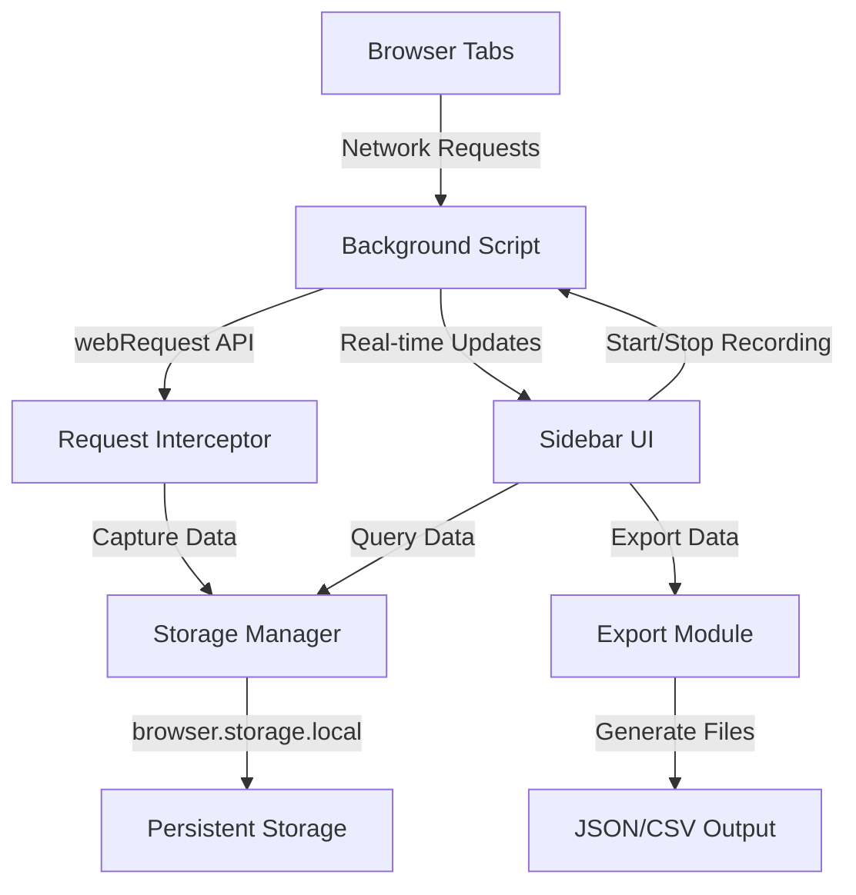

# API Network Monitor - Firefox Extension Technical Plan

## Project Overview
A Firefox browser extension that monitors and captures all API calls visible in the browser's network activity. The extension provides a persistent sidebar interface for real-time monitoring, recording, and exporting of HTTP/HTTPS requests, WebSocket connections, and GraphQL queries.

## Architecture Overview



## Technology Stack

### Core Technologies
- **Manifest Version**: 2 (Firefox WebExtensions)
- **APIs Used**:
  - `browser.webRequest` - Network request interception
  - `browser.storage.local` - Data persistence
  - `browser.runtime` - Message passing
  - `browser.sidebarAction` - Sidebar UI
  - `browser.tabs` - Tab management

### Frontend
- **HTML5** - Sidebar structure
- **CSS3** - Styling and responsive design
- **Vanilla JavaScript** - No framework dependencies for performance

## Project Structure

```
network-api-monitor/
├── manifest.json                 # Extension configuration
├── background/
│   ├── background.js            # Main background service worker
│   ├── request-interceptor.js   # Network request capture logic
│   └── storage-manager.js       # Data storage and retrieval
├── sidebar/
│   ├── sidebar.html             # Sidebar UI structure
│   ├── sidebar.js               # Sidebar logic and controls
│   └── sidebar.css              # Sidebar styling
├── utils/
│   ├── request-parser.js        # Parse different request types
│   ├── export-handler.js        # JSON/CSV export functionality
│   └── filters.js               # Request filtering and categorization
├── icons/
│   ├── icon-16.png
│   ├── icon-48.png
│   └── icon-96.png
└── README.md                     # Documentation
```

## Key Features Implementation

### 1. Network Request Interception
**API**: `browser.webRequest.onBeforeRequest`, `onSendHeaders`, `onCompleted`, `onErrorOccurred`

**Captured Data**:
- Request URL
- HTTP Method (GET, POST, PUT, DELETE, etc.)
- Request Headers
- Request Payload/Body
- Response Headers
- Response Data
- Status Code
- Timestamp (start and end)
- Duration
- Request Type (XHR, Fetch, WebSocket, etc.)

### 2. Request Type Detection

#### REST API Detection
- Standard HTTP methods
- JSON/XML content types
- RESTful URL patterns

#### GraphQL Detection
- POST requests to `/graphql` endpoints
- `application/json` content type
- Request body contains `query` or `mutation` fields

#### WebSocket Detection
- Protocol upgrade requests
- `ws://` or `wss://` URLs
- Connection upgrade headers

### 3. Data Storage Strategy

**Storage Structure**:
```javascript
{
  isRecording: boolean,
  requests: [
    {
      id: string,              // Unique identifier
      timestamp: number,       // Unix timestamp
      url: string,
      method: string,
      type: string,           // 'REST', 'GraphQL', 'WebSocket', 'Static'
      status: number,
      statusText: string,
      requestHeaders: object,
      requestBody: string,
      responseHeaders: object,
      responseBody: string,
      duration: number,       // milliseconds
      tabId: number,
      frameId: number
    }
  ],
  statistics: {
    totalRequests: number,
    byType: object,
    byStatus: object
  }
}
```

### 4. Sidebar Interface Components

#### Control Panel
- **Start Recording Button**: Begins capturing requests
- **Stop Recording Button**: Ends capture session
- **Clear Button**: Removes all captured data
- **Export Dropdown**: Choose JSON or CSV format

#### Statistics Dashboard
- Total requests captured
- Breakdown by type (REST, GraphQL, WebSocket)
- Success/Error ratio
- Average response time

#### Request List View
- Scrollable list of captured requests
- Color-coded by status (green=2xx, yellow=3xx, red=4xx/5xx)
- Shows: Method, URL, Status, Duration, Type
- Click to expand details

#### Request Details Panel
- Full request/response headers
- Formatted request/response bodies
- Timing information
- Copy buttons for easy data extraction

#### Filter Controls
- Filter by request type
- Filter by status code range
- Search by URL pattern
- Date/time range filter

### 5. Export Functionality

#### JSON Export Format
```json
{
  "exportDate": "2026-03-31T03:37:00.000Z",
  "totalRequests": 150,
  "requests": [
    {
      "id": "req_001",
      "timestamp": 1743394620000,
      "url": "https://api.example.com/users",
      "method": "GET",
      "type": "REST",
      "status": 200,
      "duration": 245,
      "requestHeaders": {},
      "responseBody": "{...}"
    }
  ]
}
```

#### CSV Export Format
Flattened structure with columns:
- ID, Timestamp, URL, Method, Type, Status, Duration, Request Headers, Response Headers, Request Body, Response Body

### 6. Performance Optimization

#### Memory Management
- Limit stored requests to 1000 by default (configurable)
- Implement circular buffer for continuous recording
- Lazy load request details on demand

#### UI Performance
- Virtual scrolling for large request lists
- Debounced search/filter operations
- Progressive rendering of request details

#### Storage Optimization
- Compress large response bodies
- Option to exclude response bodies from capture
- Periodic cleanup of old data

## Security Considerations

1. **Permissions**: Request minimal necessary permissions
2. **Data Privacy**: All data stored locally, no external transmission
3. **Content Security**: Sanitize displayed content to prevent XSS
4. **HTTPS**: Capture encrypted traffic metadata only (no decryption)

## Browser Compatibility

**Target**: Firefox 78+ (ESR and later)
**APIs**: All WebExtensions APIs are cross-browser compatible
**Future**: Can be adapted for Chrome with minimal changes

## Development Phases

### Phase 1: Core Functionality
- Basic request interception
- Simple storage system
- Minimal sidebar UI with start/stop

### Phase 2: Enhanced Capture
- WebSocket monitoring
- GraphQL detection
- Request/response body capture

### Phase 3: UI/UX
- Complete sidebar interface
- Filtering and search
- Request details view

### Phase 4: Export & Polish
- JSON/CSV export
- Performance optimization
- Documentation and testing

## Testing Strategy

### Unit Testing
- Request parser functions
- Filter logic
- Export generation

### Integration Testing
- Background script communication
- Storage operations
- UI state management

### Manual Testing
- Test with real websites (GitHub, Twitter, etc.)
- Various API types (REST, GraphQL)
- Large volume stress testing
- Export file validation

## Installation & Distribution

### Development Installation
1. Open Firefox
2. Navigate to `about:debugging`
3. Click "This Firefox"
4. Click "Load Temporary Add-on"
5. Select `manifest.json`

### Production Distribution
1. Package extension as `.xpi` file
2. Submit to Firefox Add-ons (AMO)
3. Pass Mozilla review process
4. Publish for public use

## Future Enhancements

- Request replay functionality
- HAR (HTTP Archive) format export
- Request comparison and diff view
- Custom request filtering rules
- Performance metrics and waterfall view
- Integration with external tools (Postman, Insomnia)
- Dark/Light theme toggle
- Request mocking and interception
- Automated test generation from captured requests

## Resources & References

- [Firefox WebExtensions API](https://developer.mozilla.org/en-US/docs/Mozilla/Add-ons/WebExtensions)
- [webRequest API Documentation](https://developer.mozilla.org/en-US/docs/Mozilla/Add-ons/WebExtensions/API/webRequest)
- [Sidebar Action API](https://developer.mozilla.org/en-US/docs/Mozilla/Add-ons/WebExtensions/API/sidebarAction)
- [Extension Workshop](https://extensionworkshop.com/)